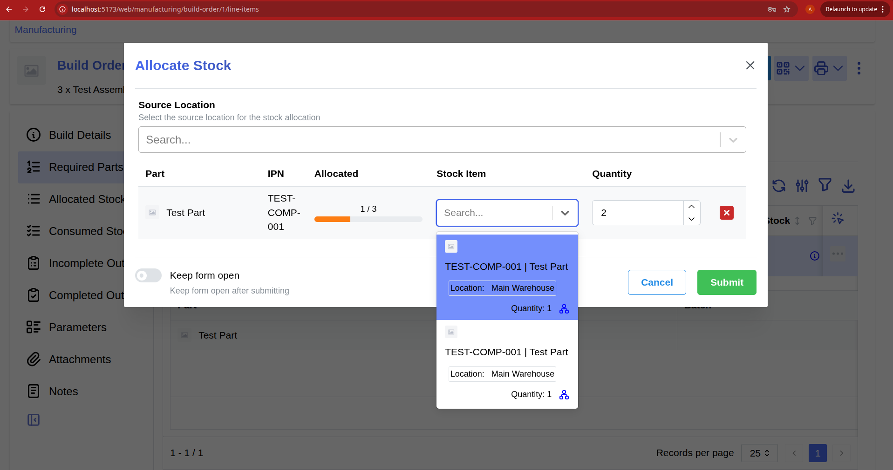

# github-contribution-log
# Contribution [#10769]: [Show "Attention needed" and "Demaged" state when allocating]

**Contribution Number:** [1]  
**Student:** [Alonso Lopez]  
**Issue:** [https://github.com/inventree/InvenTree/issues/10769]  
**Status:** [Phase I] [In Progress]

---

## Why I Chose This Issue

I chose issue #10769 "Show "Attention needed" and "Demaged" state when allocating
" because it is a clear user interface improvement that also gives me a chance to grow toward being a more well-rounded full-stack developer. Most of my experience has been stronger on the backend and data side, so working on a frontend issue in a real open source application would help me better understand how users interact with the systems behind the scenes. 

From reading the issue thread, I understand that this issue has a practical impact because showing “Attention Needed” or “Damaged” stock during allocation can help users avoid selecting problematic inventory. I left a comment on the thread which was upvoted by a maintainer, and it is not actively assigned to anyone, so it appears I am good to go. 

---

## Understanding the Issue

### Problem Description

When allocating stock, the drop down menu should show a label or badge indicating if the part is labeled as Attention Needed or Damaged. 

### Expected Behavior

Stock marked Attention Needed or Damaged should have a visible label or badge so the person allocating it knows about the condition before selecting it.

### Current Behavior

The dropdown displays information such as the part name, IPN, location, batch, and quantity, but it does not display the Attention Needed or Damaged status.

### Affected Components

The issue is specifically reproduced in the Stock Item dropdown inside the Allocate Stock window.

---

## Reproduction Process

### Environment Setup

I cloned my InvenTree fork and opened the repository using the included VS Code Dev Container. The initial container setup failed because my Linux user did not have permission to run Docker. I added my user to the docker group, logged out, and logged back in.

I then used Dev Containers: Reopen in Container. This built the development image and started the InvenTree, PostgreSQL, and Redis containers.

Inside the Dev Container, I started the backend server:

invoke dev.server

In a second Dev Container terminal, I started the frontend server:

invoke dev.frontend-server

I opened the frontend at http://localhost:5173 and logged in with a local superuser account.

Working Branch: https://github.com/Alonso-Lopez-1/InvenTree/tree/fix-issue-10769

### Steps to Reproduce

1. Navigate to **Stock → Stock Locations** and create a location named `Main Warehouse`.

2. Create a new stock-enabled component part with the following information:

   * Name: `Test Part`
   * IPN: `TEST-COMP-001`

3. Add multiple stock items for `Test Part` in `Main Warehouse`.

4. Give the stock items different statuses. At minimum, create:

   * One stock item with the normal or OK status
   * One stock item with the `Attention Needed` status
   * One stock item with the `Damaged` status

5. Optionally assign each stock item a unique batch code, such as:

   * `NORMAL-BATCH`
   * `ATTENTION-BATCH`
   * `DAMAGED-BATCH`

   This makes the individual stock items easier to identify.

6. Open each stock item and confirm that its status was saved correctly.

7. Create a new part named `Test Assembly` and configure it as an assembly that can be manufactured.

8. Open the **Bill of Materials** tab for `Test Assembly`.

9. Add `Test Part` as a BOM item and set its required quantity to `1`.

10. Create a Build Order for `Test Assembly`. A build quantity greater than `1`, such as `3`, can be used to make it easier to compare and allocate multiple stock items.

11. Issue the Build Order if it is still in the `Pending` state.

12. Open the Build Order and navigate to the **Required Parts** tab.

13. Select the row for `Test Part`.

14. Choose the **Allocate Stock** action from the available toolbar or row actions.

Do not use the shopping-cart button, because that opens the Purchase Order workflow for ordering missing parts rather than allocating existing stock.

15. In the **Allocate Stock** window, select `Main Warehouse` as the source location if necessary.

16. Open the **Stock Item** dropdown.

17. Locate the stock items that were marked `Attention Needed` and `Damaged`.

### Reproduction Evidence

- **Commit showing reproduction:**
- **Screenshots/logs:** 
- **My findings:** 

---

## Solution Approach

**Understand:** The Allocate Stock dropdown shows part, location, batch, and quantity but not stock status, so users can't see an item is "Attention needed" or "Damaged" before allocating it.

**Match:** StatusRenderer (StatusRenderer.tsx:178) already renders the exact status badge used in tables. getStatusCodes (StatusRenderer.tsx:85) is a non-hook lookup — needed since RenderStockItem is called as a plain function.

**Plan:**
1. In Stock.tsx, import StatusRenderer and getStatusCodes
2. In RenderStockItem, flag items whose status is ATTENTION or DAMAGED
3. Append a StatusRenderer badge to the existing secondary group, only when flagged

**Review:** Will self-review against project CONTRIBUTING.md, run frontend lint + type-check, and follow commit conventions before opening PR.

**Evaluate:** Reproduction steps above should now show a yellow badge on flagged items and none on OK items. Confirm no regression in the Stock Tracking table.

---

## Testing Strategy

### Unit Tests

- [ ] Test case 1: [Description]
- [ ] Test case 2: [Description]
- [ ] Test case 3: [Description]

### Integration Tests

- [ ] Integration scenario 1
- [ ] Integration scenario 2

### Manual Testing

[What you tested manually and results]

---

## Implementation Notes

### Week [X] Progress

[What you built this week, challenges faced, decisions made]

### Week [Y] Progress

[Continue documenting as you work]

### Code Changes

- **Files modified:** [List]
- **Key commits:** [Links to important commits]
- **Approach decisions:** [Why you chose certain approaches]

---

## Pull Request

**PR Link:** [GitHub PR URL when submitted]

**PR Description:** [Draft or final PR description - much of the content above can be adapted]

**Maintainer Feedback:**
- [Date]: [Summary of feedback received]
- [Date]: [How you addressed it]

**Status:** [Awaiting review / Iterating / Approved / Merged]

---

## Learnings & Reflections

### Technical Skills Gained

[What you learned technically]

### Challenges Overcome

[What was hard and how you solved it]

### What I'd Do Differently Next Time

[Reflection on your process]

---

## Resources Used

- [Link to helpful documentation]
- [Tutorial or Stack Overflow post that helped]
- [GitHub issues or discussions that helped]
