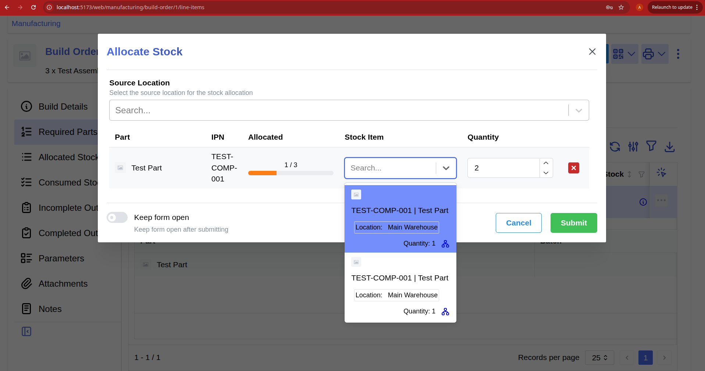

# github-contribution-log
# Contribution [#10769]: [Show "Attention needed" and "Demaged" state when allocating]

**Contribution Number:** [1]  
**Student:** [Alonso Lopez]  
**Issue:** [https://github.com/inventree/InvenTree/issues/10769]  
**Status:** [Phase 3] [In Progress]

---

## Why I Chose This Issue

I chose issue #10769 "Show "Attention needed" and "Demaged" state when allocating
" because it is a clear user interface improvement that also gives me a chance to grow toward being a more well-rounded full-stack developer. Most of my experience has been stronger on the backend and data side, so working on a frontend issue in a real open source application would help me better understand how users interact with the systems behind the scenes. 

From reading the issue thread, I understand that this issue has a practical impact because showing “Attention Needed” or “Damaged” stock during allocation can help users avoid selecting problematic inventory. I left a comment on the thread which was upvoted by a maintainer, and it is not actively assigned to anyone, so it appears I am good to go. 

---

## Understanding the Issue

### Problem Description

When allocating stock, the drop down menu should show a label or badge indicating if the part is labeled as Attention Needed or Damaged. 

### Expected Behavior

Stock marked Attention Needed or Damaged should have a visible label or badge so the person allocating it knows about the condition before selecting it.

### Current Behavior

The dropdown displays information such as the part name, IPN, location, batch, and quantity, but it does not display the Attention Needed or Damaged status.

### Affected Components

The issue is specifically reproduced in the Stock Item dropdown inside the Allocate Stock window.

---

## Reproduction Process

### Environment Setup

I cloned my InvenTree fork and opened the repository using the included VS Code Dev Container. The initial container setup failed because my Linux user did not have permission to run Docker. I added my user to the docker group, logged out, and logged back in.

I then used Dev Containers: Reopen in Container. This built the development image and started the InvenTree, PostgreSQL, and Redis containers.

Inside the Dev Container, I started the backend server:

invoke dev.server

In a second Dev Container terminal, I started the frontend server:

invoke dev.frontend-server

I opened the frontend at http://localhost:5173 and logged in with a local superuser account.

Working Branch: https://github.com/Alonso-Lopez-1/InvenTree/tree/fix-issue-10769

### Steps to Reproduce

1. Navigate to **Stock → Stock Locations** and create a location named `Main Warehouse`.

2. Create a new stock-enabled component part with the following information:

   * Name: `Test Part`
   * IPN: `TEST-COMP-001`

3. Add multiple stock items for `Test Part` in `Main Warehouse`.

4. Give the stock items different statuses. At minimum, create:

   * One stock item with the normal or OK status
   * One stock item with the `Attention Needed` status
   * One stock item with the `Damaged` status

5. Optionally assign each stock item a unique batch code, such as:

   * `NORMAL-BATCH`
   * `ATTENTION-BATCH`
   * `DAMAGED-BATCH`

   This makes the individual stock items easier to identify.

6. Open each stock item and confirm that its status was saved correctly.

7. Create a new part named `Test Assembly` and configure it as an assembly that can be manufactured.

8. Open the **Bill of Materials** tab for `Test Assembly`.

9. Add `Test Part` as a BOM item and set its required quantity to `1`.

10. Create a Build Order for `Test Assembly`. A build quantity greater than `1`, such as `3`, can be used to make it easier to compare and allocate multiple stock items.

11. Issue the Build Order if it is still in the `Pending` state.

12. Open the Build Order and navigate to the **Required Parts** tab.

13. Select the row for `Test Part`.

14. Choose the **Allocate Stock** action from the available toolbar or row actions.

Do not use the shopping-cart button, because that opens the Purchase Order workflow for ordering missing parts rather than allocating existing stock.

15. In the **Allocate Stock** window, select `Main Warehouse` as the source location if necessary.

16. Open the **Stock Item** dropdown.

17. Locate the stock items that were marked `Attention Needed` and `Damaged`.

### Reproduction Evidence

- **Commit showing reproduction:**
- **Screenshots/logs:** 
- **My findings:** 

---

## Original Solution Approach

**Understand:** The Allocate Stock dropdown shows part, location, batch, and quantity but not stock status, so users can't see an item is "Attention needed" or "Damaged" before allocating it.

**Match:** StatusRenderer (StatusRenderer.tsx:178) already renders the exact status badge used in tables. getStatusCodes (StatusRenderer.tsx:85) is a non-hook lookup — needed since RenderStockItem is called as a plain function.

**Plan:**
1. In Stock.tsx, import StatusRenderer and getStatusCodes
2. In RenderStockItem, flag items whose status is ATTENTION or DAMAGED
3. Append a StatusRenderer badge to the existing secondary group, only when flagged

**Review:** Will self-review against project CONTRIBUTING.md, run frontend lint + type-check, and follow commit conventions before opening PR.

**Evaluate:** Reproduction steps above should now show a yellow badge on flagged items and none on OK items. Confirm no regression in the Stock Tracking table.

---

## Testing Strategy

### Unit Tests

- [ ] Test case 1: [Confirm that a stock item with the ATTENTION status renders an Attention Needed status badge.]
- [ ] Test case 2: [Confirm that a stock item with the DAMAGED status renders a Damaged status badge.]
- [ ] Test case 3: [Confirm that a stock item with the normal or OK status does not render an extra status badge.]

I have not added automated frontend tests yet. Since this is a small UI rendering change, my first validation step was manual testing in the local development environment. My next step is to look for existing frontend renderer tests or dropdown tests in InvenTree and model a focused test after the existing project pattern.

### Integration Tests

- [ ] Integration scenario 1: Open a Build Order allocation window and confirm that the Stock Item dropdown shows status badges for Attention Needed and Damaged stock items.
- [ ] Integration scenario 2: Confirm that the dropdown still allows selecting and allocating stock normally after the badge rendering change.

### Manual Testing

Manual validation completed so far:

- Started the backend server with invoke dev.server.
- Started the frontend server with invoke dev.frontend-server.
- Created a test stock location, test part, and multiple stock items with different statuses.
- Created a test assembly. Build Order, Sales Order, and Transfer Order. 
- Opened the Allocate Stock window from the Build Order Required Parts tab.
- Opened the Stock Item dropdown and confirmed that the status badge appears for the flagged stock items.
- Confirmed that normal or OK stock items do not show the Attention Needed or Damaged badge.
- I also attempted a more scoped opt-in approach so that the badge would only appear in allocation dropdowns, but that version broke existing dropdown behavior. I reverted to the working renderer-based implementation for now and documented the scoping concern as a follow-up item before opening the final PR.
---

## Implementation Notes

### Week [3] Progress

This week, I moved from reproduction and planning into implementation for InvenTree issue #10769.

What I built:

Modified src/frontend/src/components/render/Stock.tsx.
Updated RenderStockItem so stock items marked as Attention Needed or Damaged can show a compact status badge.
Reused the existing StatusRenderer component instead of creating a new badge component.
Used getStatusCodes(ModelType.stockitem) to look up stock status information without adding a React hook inside RenderStockItem.
Kept the change focused on the two statuses requested in the issue, Attention Needed and Damaged.

Challenges faced:

My first working implementation added the badge through the shared RenderStockItem renderer. This made the badge appear in the allocation dropdown, but I realized it may also affect other places that render stock items.
I tried an updated opt-in approach that would only enable the badge in specific allocation dropdowns. However, that version broke some existing dropdown behavior, so I reverted back to the working implementation.

Decisions made:

I decided to keep the working implementation for the check-in so I could show progress, document the tradeoff, and continue iterating.
Before opening the final PR, I plan to either find a safer way to scope the badge only to allocation dropdowns or ask for feedback on whether the renderer-based approach is acceptable.

### Week [7] Progress — Maintainer Feedback and Revised Plan

After submitting PR #12286, I received feedback that the implementation should display stock status consistently rather than using allocation-specific opt-in checks. My initial PR modified three files so that only Build Order and Sales Order allocation fields could request the status badge. Although this kept the behavior narrowly scoped, it introduced extra conditions and complexity. Before modifying the PR, I documented the revised plan and identified the manual and automated checks needed to make sure shared stock-item dropdown behavior is not broken.

### Code Changes

- **Files modified:** [src/frontend/src/components/render/Stock.tsx]
- **Key commits:** [[Commit Link Here](https://github.com/Alonso-Lopez-1/InvenTree/tree/fix-issue-10769)]
- **Approach decisions:** [I reused InvenTree's existing StatusRenderer so the new badge matches the rest of the UI. I limited the badge logic to the Attention Needed and Damaged statuses because those are the statuses requested in the issue.]

### Week [8] Progress
This week, I began implementing the revised solution for InvenTree issue #10769 based on the feedback I received on PR #12286.

The maintainer recommended simplifying my original implementation by displaying the stock status through the shared `RenderStockItem` renderer instead of using opt-in flags and allocation-specific checks. I began removing the more complex logic and attempted to render each stock item's status directly through the existing `StatusRenderer`.

#### What I worked on

- Reviewed the maintainer feedback and compared it against my original implementation.
- Began removing the opt-in flag that was passed specifically by the Build Order and Sales Order allocation fields.
- Revised the conditional logic that limited the badge to only the `ATTENTION` and `DAMAGED` statuses.
- Attempted to display the current stock status directly inside the shared `RenderStockItem` function.
- Continued reusing InvenTree's existing `StatusRenderer` and stock status definitions rather than creating a new badge component.

#### Current challenge

The simpler implementation is not displaying the status badge in the stock item dropdown. Although the stock item data is still being rendered correctly, adding the status through the shared renderer has not produced a visible badge with my current approach. This means I do not yet have a working replacement for the original implementation. I am currently investigating this issue to determine the cause. 

## Week [9] Progress

This week, I resolved the badge-rendering issue that I encountered during Week 8. I identified why the stock status badge was not appearing when I attempted to render it through the shared `RenderStockItem` function and was able to produce a working implementation.

### What I Worked On

- Investigated why the status badge was not rendering through the shared `RenderStockItem` function.
- Identified and corrected the issue that prevented the badge from appearing.
- Confirmed that the stock status can now be displayed as part of the secondary information rendered for a stock item.
- Tested several approaches for controlling when and where the secondary status badge should appear.

### Current Decision

The shared-renderer approach appears to be the simplest implementation and is consistent with the previous feedback to avoid allocation-specific opt-in checks. However, this also means that the status badge would be displayed anywhere `RenderStockItem` is used rather than only in the Build Order and Sales Order allocation forms.

Before finalizing the implementation, I reached out for clarification on whether the preferred solution is to keep the change as simple as possible and display the secondary status badge consistently in every form where `RenderStockItem` is utilized.

### Current Status

The badge-rendering problem from Week 8 has been resolved, and I now have a working implementation. I am waiting for clarification about the intended scope before selecting the final approach and updating PR #12286.

### Next Steps

- Review the feedback about whether the badge should appear everywhere `RenderStockItem` is used.
- Finalize either the shared-renderer implementation or a more narrowly scoped alternative.
- Test the selected approach across the forms and dropdowns that use `RenderStockItem`.
- Confirm that stock-item selection and allocation behavior continue to work normally.
- Update the existing pull request with the final implementation and testing results.

## Week [10] Progress

This week, I received a reply from the maintainer clarifying what they meant by their previous feedback about displaying the stock status consistently. With that clarification, I was able to better understand the intended scope of the change and move forward with a more confident implementation.

### What I Worked On

- Reviewed the maintainer's clarification and compared it against the approaches I had tested previously.
- Tested multiple implementations to determine the simplest way to match the requested behavior.
- Verified that the status badge renders correctly through the shared `RenderStockItem` behavior.
- Checked how the updated rendering appears in different areas of the application where `RenderStockItem` is used.

### Final Implementation Direction

Based on the clarification I received, I now have an implementation that matches the requested behavior. Rather than adding allocation-specific conditions or opt-in flags, the stock status is handled through the shared stock item rendering logic. This keeps the implementation simpler and allows the status information to appear consistently in the places where `RenderStockItem` is already used.

### Screenshots

Before resubmitting the changes, I am preparing screenshots that show how the updated status rendering appears throughout the application.These screenshots will help demonstrate the effect of using the shared `RenderStockItem` implementation and provide visual confirmation of how the new behavior appears in the different forms where the renderer is used. These screenshots demonstrate some of the other areas where the badge will appear outside of the Sales Order, Build Order, and Transfer Order forms.

#### Consume Stock Item

The stock status badge is displayed when selecting a stock item through the Consume Stock Item interface.

#### Disassemble Stock Item

The status badge is also displayed when selecting stock through the Disassemble Stock Item interface.

#### Global Search

The shared renderer causes the stock status to also appear when a stock item is displayed through the global search interface.

#### Installed Items Dropdown

The stock status is displayed in the Installed Items dropdown where the shared stock item renderer is also utilized.

#### Stock Tracking After Installing

The status badge continues to display when viewing the stock item through the Stock Tracking interface after installation.

### Current Status

The implementation is now aligned with the maintainer's clarified feedback, and I have completed the main development and manual validation work. My next step is to resubmit the updated code to PR #12286 along with screenshots showing how the new implementation appears throughout the application.

### Next Steps

- Add screenshots demonstrating the updated status rendering in different parts of the application.
- Perform a final review of the code and diff.
- Run the relevant frontend formatting, linting, type-checking, and tests.
- Push the finalized implementation to the existing `fix-issue-10769` branch.
- Update PR #12286 with the revised code and screenshots.

---

## Pull Request

**PR Link:** [[https://github.com/inventree/InvenTree/pull/12286](https://github.com/inventree/InvenTree/pull/12286)

**PR Description:** 
What does this PR do? This PR fixes InvenTree issue #10769 by displaying the “Damaged” and “Attention Needed” stock status badges in the stock allocation dropdowns for Build Orders and Sales Orders. The change uses InvenTree’s existing status badge rendering so users can identify flagged stock items before allocating them.

Why was it needed? People needed to be able to see if a stock item was damaged or needed attention when allocating. 

What are the relevant issue numbers?: Closes #10769

Does this PR meet the acceptance criteria?:
[ ] Tests added for new behavior
[x] All tests passing
[x] Follows Ruby style guide
[x] No breaking changes

**Maintainer Feedback:**
- Jun 30: Opened PR #12286 against the upstream InvenTree repository. Review has been requested from SchrodingersGat as a code owner.
- July 2026: The maintainer suggested displaying the stock status all the time rather than using the more complex opt-in and status-specific checks.
- Based on this feedback, I returned to Phase II planning to revise the approach before updating the existing PR.
  
**Status:** [Revising implementation after maintainer feedback]

---

## Learnings & Reflections

### Technical Skills Gained

I gained practice reusing existing UI components. This helped me better understand how to make a small frontend change while still keeping the behavior scoped to the correct places.

### Challenges Overcome

The hardest part was making sure the badge appeared in the allocation dropdowns without affecting unrelated stock item dropdowns. My first implementation worked visually, but it was too broad. I then updated the approach so the status badge is controlled by an opt-in flag from the Build Order and Sales Order allocation fields.

---

## Revised Solution Approach After Maintainer Feedback

### Reason for Revision

After submitting PR #12286, the maintainer suggested simplifying the implementation by displaying the stock status consistently rather than using conditional and opt-in checks to show only the “Attention Needed” and “Damaged” statuses.

### Understand

The stock item renderer currently displays identifying information such as the part, location, batch, and quantity, but it does not consistently display the stock item's status. My original solution added special checks so that only “Attention Needed” and “Damaged” badges appeared in Build Order and Sales Order allocation dropdowns.

Based on the maintainer’s feedback, the revised goal is to display the available stock status as part of the standard stock item rendering rather than adding allocation-specific conditions.

### Match

`StatusRenderer` already provides InvenTree’s standard visual representation for model statuses, and `getStatusCodes(ModelType.stockitem)` provides the corresponding stock-item status definitions.

The existing shared `RenderStockItem` function is the appropriate place for this behavior because it is responsible for presenting stock-item information wherever that renderer is used.

### Plan

1. Remove the opt-in property and allocation-specific checks introduced by the original implementation.
2. Remove the conditional logic that limits rendering to only the `ATTENTION` and `DAMAGED` statuses.
3. Use the stock item’s current status with `StatusRenderer` inside `RenderStockItem`.
4. Display the status consistently whenever a stock item is rendered through this shared renderer.
5. Remove any now-unnecessary changes from the Build Order and Sales Order allocation field definitions.
6. Keep the implementation focused by reusing the existing status-rendering utilities rather than creating a new badge component.

### Files Expected to Change

- `src/frontend/src/components/render/Stock.tsx`
- Any Build Order or Sales Order files previously modified only to pass the opt-in flag will be restored unless another change is still required.

### Implement

The revised implementation will be pushed to the existing `fix-issue-10769` branch and submitted as additional commits to PR #12286.

### Review

I will compare the revised changes against the maintainer’s feedback and InvenTree’s contribution guidelines. I will also review the final diff to confirm that the previous opt-in flag, status-specific conditions, and unnecessary allocation-field changes have been removed.

### Evaluate

I will verify that:

1. Stock items with the “Attention Needed” status display their status.
2. Stock items with the “Damaged” status display their status.
3. Stock items with other statuses, including “OK,” also display their status when rendered.
4. The status appears correctly in Build Order and Sales Order allocation dropdowns.
5. Other locations that use `RenderStockItem` continue to display and select stock items correctly.
6. Frontend formatting, linting, type-checking, and relevant tests pass.

## Resources Used

- [Link to helpful documentation]
- [Tutorial or Stack Overflow post that helped]
- [GitHub issues or discussions that helped]
